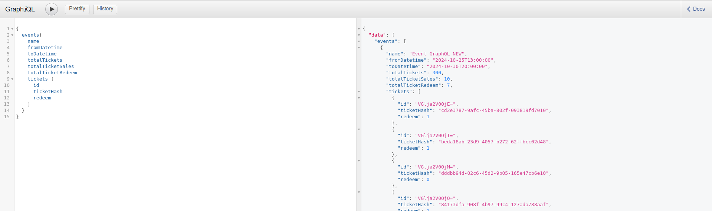

# Prueba técnica

El repositorio fue creado con la finalidad de realizar una prueba técnica, referente a un servicio que llevar a cabo la administración de boletos de eventos.


## Instalación

#### 1.- Usar la herramienta [docker-compose](https://docs.docker.com/compose/) para realizar la construcción y levantamiento de los contenedores.

```bash
docker-compose build
```
```bash
docker-compose up
```

#### 2.- Para la instalación de la base de datos deberemos acceder al contenedor

```bash
docker exec -it tickets_db bash
```
Después ejecutaremos el script que realizara la creación de la base de datos y sus tablas

```bash
mysql --host=127.0.0.1 --port=3306 -u root -p < usr/local/mysql/db.sql
```
Nos pedirá ingresar la contraseña

```bash
Enter password: p4ss_r007
```
Una vez finalizada la operación podemos salir del contenedor

```bash
exit
```
## Estructura del proyecto
    .
    ├── app                                            
    │   ├── controllers
    │   │   ├── base_controller.py
    │   │   ├── event_controller.py
    │   │   └── ticket_controller.py
    │   ├── database
    │   │   └── mysql_db.py
    │   ├── graphql
    │   │   ├── event_mutation.py
    │   │   ├── mutation.py
    │   │   ├── object.py
    │   │   ├── query.py
    │   │   └── ticket_mutation.py
    │   ├── models
    │   │   ├── event_models.py
    │   │   └── ticket_models.py
    │   ├── routes
    │   │   ├── event_routes.py
    │   │   └── ticket_routes.py
    │   ├── schemas
    │   └── schema.py
    │   ├── test
    │   │   ├── unit
    │   │   │   ├── test_event_constroller.py
    │   │   │   ├── test_event_models.py
    │   │   │   ├── test_ticket_constroller.py
    │   │   │   ├── test_ticket_models.py
    │   └── __init__.py
    ├── tickets-db                                    
    │   └── db.sql                                    
    ├── .gitignore                                    
    ├── config.py                                     
    ├── docker-compose.yaml                           
    ├── Dockerfile                                    
    ├── README.md                                     
    ├── requirements.txt                              
    └── run.py             

## Estructura de la base de datos
   

## Pruebas unitarias
Para realizar la ejecución de las pruebas unitarias sera con el siguiente comando

```bash
python3.11 -m unittest app/test/unit/*.py
```

Como resultado mostrara la cantidad de pruebas ejecutadas y su estatus

```bash
............
----------------------------------------------------------------------
Ran 31 tests in 0.400s

OK
```

## REST API
A continuación se describen los servicios rest contenidos

### Obtener todos los eventos y sus boletos

#### Petición
```bash
GET /events

curl --location 'http://127.0.0.1:5000/events'
```

#### Respuesta
```bash
{
    "status": true,
    "status_code": 200,
    "message": "Success",
    "data": [
        {
            "id": 1,
            "total_tickets": 300,
            "to_datetime": "2024-10-27 20:00:00",
            "total_ticket_redeem": 300,
            "name": "Gran premio de mexico",
            "from_datetime": "2024-10-25 08:00:00",
            "total_ticket_sales": 300
        }
    ]
}
```

### Obtener un evento y sus boletos

#### Petición
```bash
GET /events/{event_id}

curl --location 'http://127.0.0.1:5000/events/{event_id}'
```

#### Respuesta
```bash
{
    "status": true,
    "status_code": 200,
    "message": "Success",
    "data": {
        "id": 1,
        "total_tickets": 200,
        "to_datetime": "2024-10-27 20:00:00",
        "total_ticket_redeem": 0,
        "from_datetime": "2024-10-25 08:00:00",
        "name": "Gran premio de mexico",
        "total_ticket_sales": 0
    }
}
```

### Crear un evento

#### Petición
```bash
POST /events

curl --location 'http://127.0.0.1:5000/events' \
--header 'Content-Type: application/json' \
--data '{
    "to_datetime": "2024-10-27 20:00:00",
    "from_datetime": "2024-10-25 08:00:00",
    "name": "Gran premio de mexico",
    "total_tickets": 200
}'
```

#### Respuesta
```bash
{
    "status": true,
    "status_code": 200,
    "message": "Create successful",
    "data": {
        "id": 3,
        "name": "Gran premio de mexico",
        "from_datetime": "2024-10-25 08:00:00",
        "to_datetime": "2024-10-27 20:00:00",
        "total_tickets": 200,
        "total_ticket_sales": 0,
        "total_ticket_redeem": 0
    }
}
```
### Actualizar un evento

#### Petición
```bash
PUT /events/{event_id}

curl --location --request PUT 'http://127.0.0.1:5000/events/{event_id}' \
--header 'Content-Type: application/json' \
--data '{
    "name": "Gran premio de mexico",
    "from_datetime": "2024-10-25 08:00:00",
    "to_datetime": "2024-10-27 20:00:00",
    "total_tickets": 200
}'
```

#### Respuesta
```bash
{
    "status": true,
    "status_code": 200,
    "message": "Update successful",
    "data": {
        "id": "1",
        "name": "Gran premio de mexico",
        "from_datetime": "2024-10-25 08:00:00",
        "to_datetime": "2024-10-27 20:00:00",
        "total_tickets": 200,
        "total_ticket_sales": 0,
        "total_ticket_redeem": 0
    }
}
```

### Eliminar un evento

#### Petición
```bash
DELETE /events/{event_id}

curl --location --request DELETE 'http://127.0.0.1:5000/events/{event_id}'
```

#### Respuesta
```bash
{
    "status": true,
    "status_code": 200,
    "message": "Destroy successful",
    "data": {
        "affected_rows": 1
    }
}
```

### Obtener boletos de un evento

#### Petición
```bash
GET /events/{event_id}/tickets

curl --location 'http://127.0.0.1:5000/events/{event_id}/tickets'
```

#### Respuesta
```bash
{
    "status": true,
    "status_code": 200,
    "message": "Success",
    "data": [
        {
            "event_id": 1,
            "id": 1,
            "redeem": 0,
            "ticket_hash": "cd2e3787-9afc-45ba-802f-093819fd7010"
        }
    ]
}
```

### Comprar boleto de un evento

#### Petición
```bash
POST /events/{event_id}/tickets

curl --location --request POST 'http://127.0.0.1:5000/events/{event_id}/tickets'
```

#### Respuesta
```bash
{
    "status": true,
    "status_code": 200,
    "message": "Create successful",
    "data": {
        "id": 1,
        "event_id": 1,
        "event_name": "Gran premio de mexico",
        "ticket_hash": "cd2e3787-9afc-45ba-802f-093819fd7010",
        "redeem": 0
    }
}
```

### Canjear boleto de evento

#### Petición
```bash
PATCH /events/{event_id}/tickets/{ticket_id}/redeem

curl --location --request PATCH 'http://127.0.0.1:5000/events/{event_id}/tickets/{ticket_id}/redeem'
```

#### Respuesta
```bash
{
    "status": true,
    "status_code": 200,
    "message": "Update successful",
    "data": {
        "id": 1,
        "event_id": 1,
        "event_name": "Gran premio de mexico",
        "ticket_hash": "cd2e3787-9afc-45ba-802f-093819fd7010",
        "redeem": 1
    }
}
```

## GRAPHQL
A continuación se describe el servicio, con las diferentes queries para realizar las acciones por medio de GraphQL.

#### Petición
```bash
POST /graphql
```

### Obtener todos los eventos y sus boletos

#### Consulta
```bash
{
  events{
    name
    fromDatetime
    toDatetime
    totalTickets
    totalTicketSales
    totalTicketRedeem
    tickets {
      id
      ticketHash
      redeem
    }
  }
}
```

#### Respuesta
```bash
{
    "data": {
        "events": [
            {
                "name": "Event GraphQL NEW",
                "fromDatetime": "2024-10-25T13:00:00",
                "toDatetime": "2024-10-30T20:00:00",
                "totalTickets": 300,
                "totalTicketSales": 9,
                "totalTicketRedeem": 6,
                "tickets": [
                    {
                        "id": "VGlja2V0OjE=",
                        "ticketHash": "cd2e3787-9afc-45ba-802f-093819fd7010",
                        "redeem": 1
                    },
                    {
                        "id": "VGlja2V0OjI=",
                        "ticketHash": "beda18ab-23d9-4057-b272-62ffbcc02d48",
                        "redeem": 1
                    }
                ]
            }
        ]
    }
}
```

### Obtener un evento y sus boletos

#### Consulta
```bash
{
  events(id:"1"){
    name
    fromDatetime
    toDatetime
    totalTickets
    totalTicketSales
    totalTicketRedeem
    tickets {
      id
      ticketHash
      redeem
    } 
  }
}
```

#### Respuesta
```bash
{
    "data": {
        "events": [
            {
                "name": "Event GraphQL NEW",
                "fromDatetime": "2024-10-25T13:00:00",
                "toDatetime": "2024-10-30T20:00:00",
                "totalTickets": 300,
                "totalTicketSales": 9,
                "totalTicketRedeem": 6,
                "tickets": [
                    {
                        "id": "VGlja2V0OjE=",
                        "ticketHash": "cd2e3787-9afc-45ba-802f-093819fd7010",
                        "redeem": 1
                    },
                    {
                        "id": "VGlja2V0OjI=",
                        "ticketHash": "beda18ab-23d9-4057-b272-62ffbcc02d48",
                        "redeem": 1
                    }
                ]
            }
        ]
    }
}
```

### Crear un evento


#### Consulta
```bash
mutation {
  mutateCreateEvent(
    name:"Event GraphQL NEW",
    fromDatetime:"2024-10-25 13:00:00",
    toDatetime: "2024-10-30 20:00:00",
    totalTickets: 200
  ){
    event{
      name
    	fromDatetime
    	toDatetime
    	totalTickets
    }
  }
}
```

#### Respuesta
```bash
{
    "data": {
        "mutateCreateEvent": {
            "event": {
                "name": "Event GraphQL NEW",
                "fromDatetime": "2024-10-25T13:00:00",
                "toDatetime": "2024-10-30T20:00:00",
                "totalTickets": 200
            }
        }
    }
}
```

### Actualizar un evento

#### Consulta
```bash
mutation {
  mutateUpdateEvent(
    eventId: 1
    name:"Event GraphQL NEW",
    fromDatetime:"2024-10-25 13:00:00",
    toDatetime: "2024-10-30 20:00:00",
    totalTickets: 300
  ){
    event {
      name
      fromDatetime
      toDatetime
      totalTickets
    }
  }
}
```

#### Respuesta
```bash
{
    "data": {
        "mutateUpdateEvent": {
            "event": {
                "name": "Event GraphQL NEW",
                "fromDatetime": "2024-10-25T13:00:00",
                "toDatetime": "2024-10-30T20:00:00",
                "totalTickets": 300
            }
        }
    }
}
```
### Eliminar un evento

#### Consulta
```bash
mutation {
  mutateDeleteEvent(
    eventId: 7
  ){
  	event{
    	name
      fromDatetime
      toDatetime
      totalTickets
      totalTicketSales
  	}
  }
}
```

#### Respuesta
```bash
{
    "data": {
        "mutateDeleteEvent": {
            "event": {
                "name": "Event GraphQL NEW",
                "fromDatetime": "2024-10-20T13:00:00",
                "toDatetime": "2024-10-20T20:00:00",
                "totalTickets": 200,
                "totalTicketSales": 0
            }
        }
    }
}
```

### Comprar boleto de un evento

#### Consulta
```bash
mutation {
  mutateBuyTicket(
    eventId: 1
  ){
    ticket{
      eventId
      ticketHash
      redeem
    }
  }
} 
```

#### Respuesta
```bash
{
    "data": {
        "mutateBuyTicket": {
            "ticket": {
                "eventId": 1,
                "ticketHash": "62d18b3f-5d96-4700-b0c3-89238010a832",
                "redeem": 0
            }
        }
    }
}
```

### Canjear boleto de evento

#### Consulta
```bash
mutation {
  mutateRedeemTicket(
    eventId: 1,
    ticketId: 10
  ){
    ticket{
      eventId
      ticketHash
      redeem
    }
  }
}  
```

#### Respuesta
```bash
{
    "data": {
        "mutateRedeemTicket": {
            "ticket": {
                "eventId": 1,
                "ticketHash": "62d18b3f-5d96-4700-b0c3-89238010a832",
                "redeem": 1
            }
        }
    }
}
```

### GraphQL IDE
Cuando el servidor se este corriendo, es posible acceder al GraphQL IDE por medio de la siguiente URL en el navegador
```bash
http://127.0.0.1:5000/graphql
```
